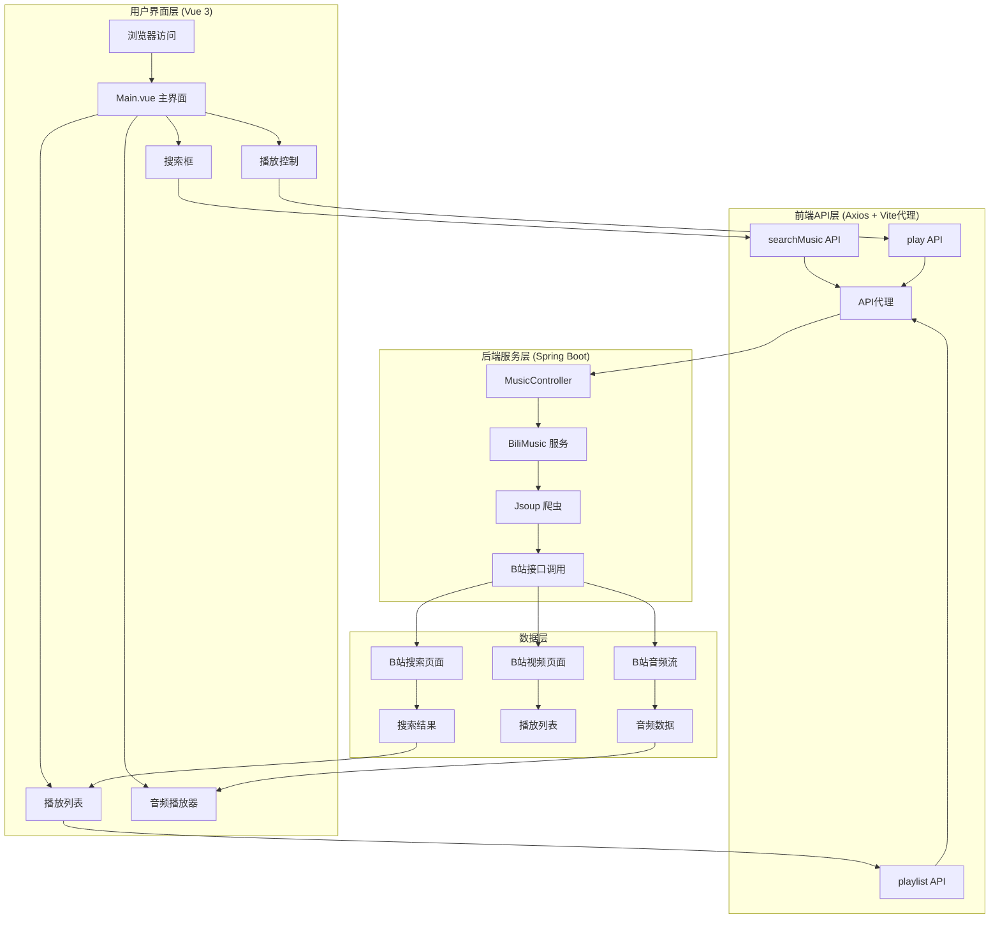
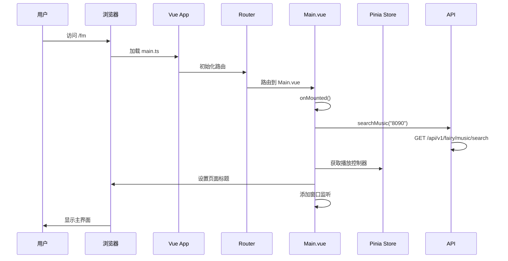
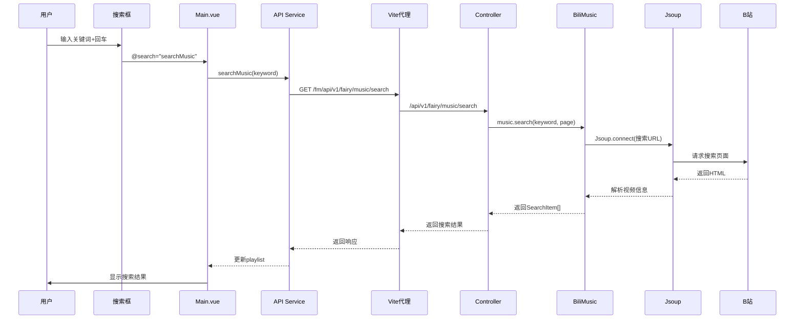
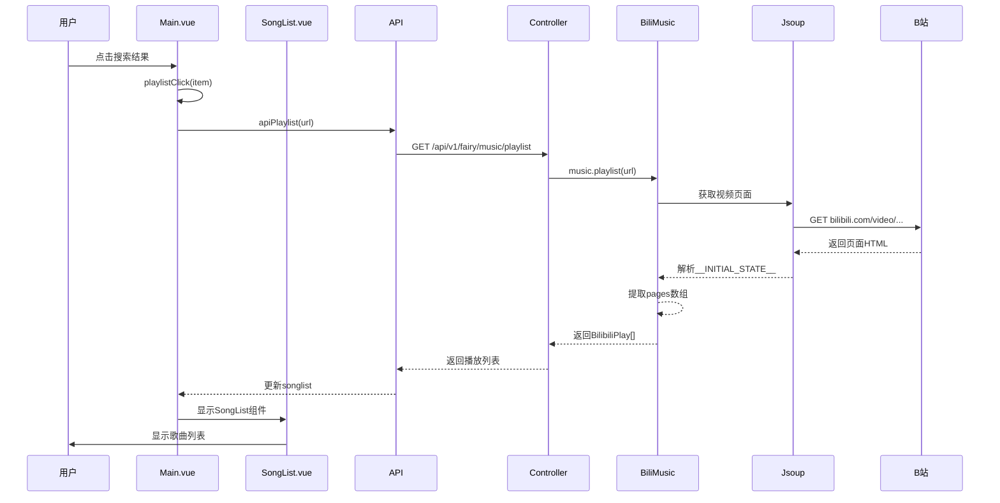
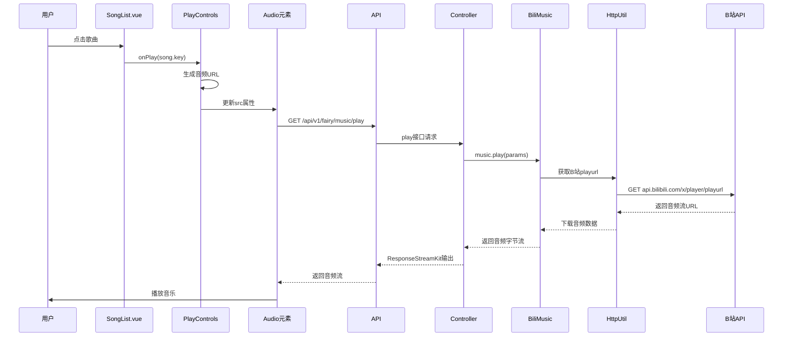
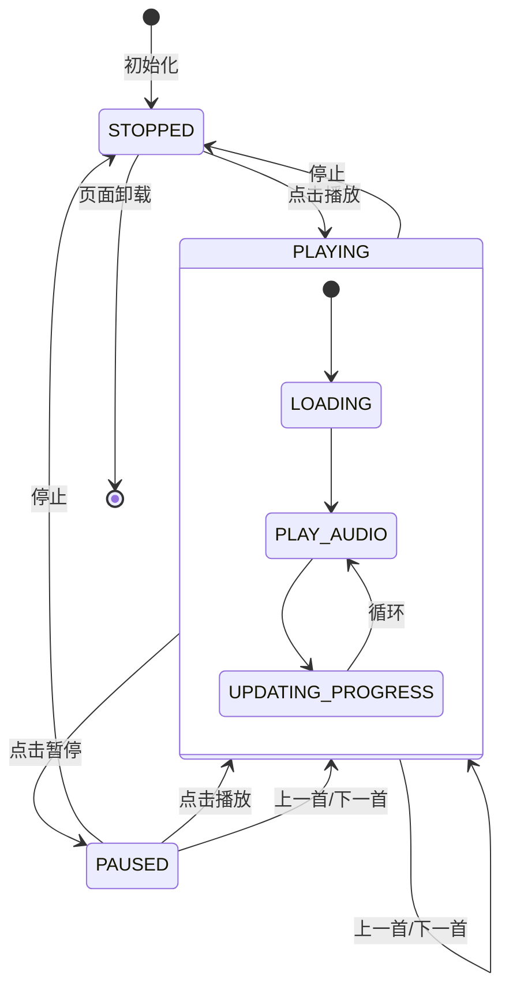
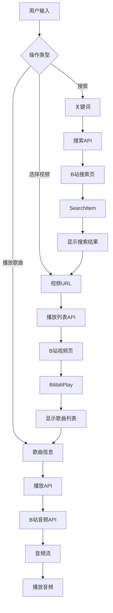
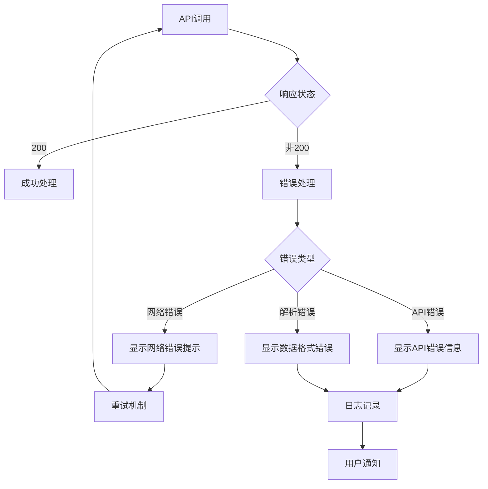
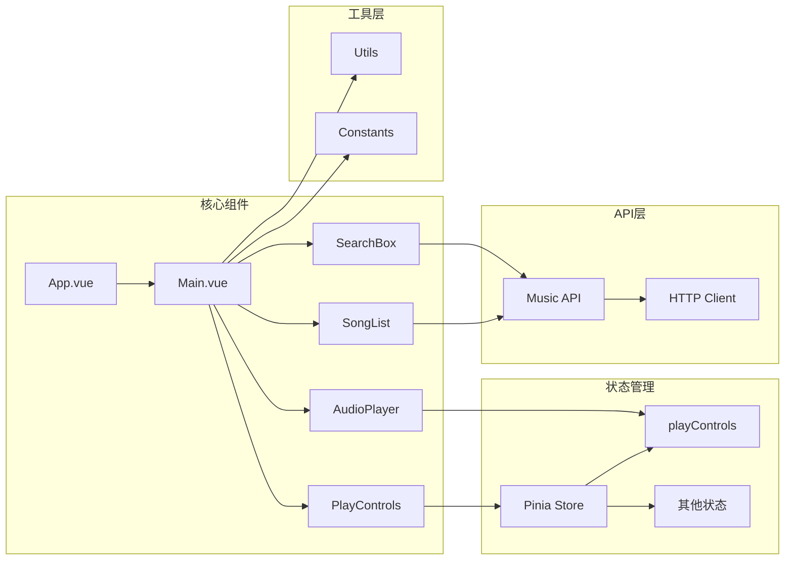
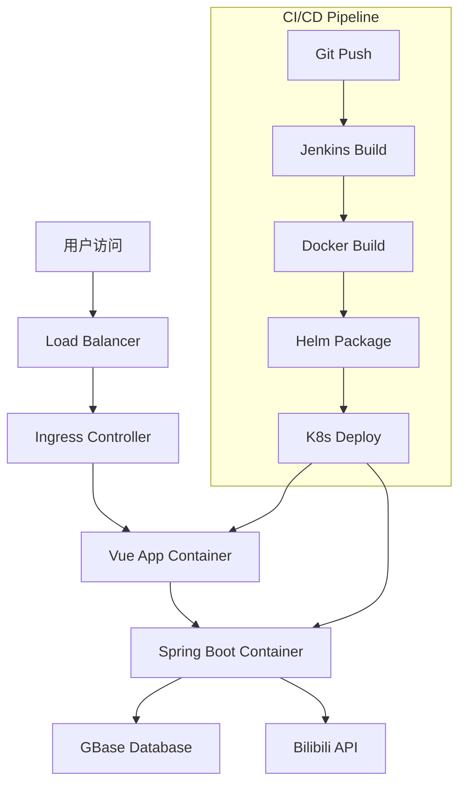

# Fairy Music 播放器调用流程图

## 1. 系统整体架构流程图

```mermaid
graph TD
    subgraph "用户界面层 (Vue 3)"
        A[浏览器访问] --> B[Main.vue 主界面]
        B --> C[搜索框]
        B --> D[播放列表]
        B --> E[音频播放器]
        B --> F[播放控制]
    end

    subgraph "前端API层 (Axios + Vite代理)"
        C --> G[searchMusic API]
        D --> H[playlist API]
        F --> I[play API]
        
        G --> J[API代理]
        H --> J
        I --> J
    end

    subgraph "后端服务层 (Spring Boot)"
        J --> K[MusicController]
        K --> L[BiliMusic 服务]
        L --> M[Jsoup 爬虫]
        M --> N[B站接口调用]
    end

    subgraph "数据层"
        N --> O[B站搜索页面]
        N --> P[B站视频页面]
        N --> Q[B站音频流]
        
        O --> R[搜索结果]
        P --> S[播放列表]
        Q --> T[音频数据]
    end
    
    T --> E[音频播放器]
    R --> D[播放列表]
```

## 2. 应用启动流程图

```mermaid
sequenceDiagram
    participant U as 用户
    participant B as 浏览器
    participant V as Vue App
    participant R as Router
    participant M as Main.vue
    participant S as Pinia Store
    participant A as API

    U->>B: 访问 /fm
    B->>V: 加载 main.ts
    V->>R: 初始化路由
    R->>M: 路由到 Main.vue
    M->>M: onMounted()
    M->>A: searchMusic("8090")
    A->>A: GET /api/v1/fairy/music/search
    M->>S: 获取播放控制器
    M->>B: 设置页面标题
    M->>M: 添加窗口监听
    B->>U: 显示主界面
```

## 3. 音乐搜索流程图

```mermaid
sequenceDiagram
    participant U as 用户
    participant I as 搜索框
    participant M as Main.vue
    participant A as API Service
    participant P as Vite代理
    participant C as Controller
    participant B as BiliMusic
    participant J as Jsoup
    participant S as B站

    U->>I: 输入关键词+回车
    I->>M: @search="searchMusic"
    M->>A: searchMusic(keyword)
    A->>P: GET /fm/api/v1/fairy/music/search
    P->>C: /api/v1/fairy/music/search
    C->>B: music.search(keyword, page)
    B->>J: Jsoup.connect(搜索URL)
    J->>S: 请求搜索页面
    S-->>J: 返回HTML
    J-->>B: 解析视频信息
    B-->>C: 返回SearchItem[]
    C-->>P: 返回搜索结果
    P-->>A: 返回响应
    A-->>M: 更新playlist
    M->>U: 显示搜索结果
```

## 4. 播放列表获取流程图

```mermaid
sequenceDiagram
    participant U as 用户
    participant M as Main.vue
    participant S as SongList.vue
    participant A as API
    participant C as Controller
    participant B as BiliMusic
    participant JS as Jsoup
    participant BB as B站

    U->>M: 点击搜索结果
    M->>M: playlistClick(item)
    M->>A: apiPlaylist(url)
    A->>C: GET /api/v1/fairy/music/playlist
    C->>B: music.playlist(url)
    B->>JS: 获取视频页面
    JS->>BB: GET bilibili.com/video/...
    BB-->>JS: 返回页面HTML
    JS-->>B: 解析__INITIAL_STATE__
    B-->>B: 提取pages数组
    B-->>C: 返回BilibiliPlay[]
    C-->>A: 返回播放列表
    A-->>M: 更新songlist
    M->>S: 显示SongList组件
    S->>U: 显示歌曲列表
```

## 5. 音频播放流程图

```mermaid
sequenceDiagram
    participant U as 用户
    participant S as SongList.vue
    participant P as PlayControls
    participant AU as Audio元素
    participant A as API
    participant C as Controller
    participant B as BiliMusic
    participant H as HttpUtil
    participant BA as B站API

    U->>S: 点击歌曲
    S->>P: onPlay(song.key)
    P->>P: 生成音频URL
    P->>AU: 更新src属性
    AU->>A: GET /api/v1/fairy/music/play
    A->>C: play接口请求
    C->>B: music.play(params)
    B->>H: 获取B站playurl
    H->>BA: GET api.bilibili.com/x/player/playurl
    BA-->>H: 返回音频流URL
    H-->>B: 下载音频数据
    B-->>C: 返回音频字节流
    C-->>A: ResponseStreamKit输出
    A-->>AU: 返回音频流
    AU->>U: 播放音乐
```

## 6. 播放控制流程图

```mermaid
stateDiagram-v2
    [*] --> STOPPED: 初始化

    STOPPED --> PLAYING: 点击播放
    PLAYING --> PAUSED: 点击暂停
    PAUSED --> PLAYING: 点击播放

    PLAYING --> PLAYING: 上一首/下一首
    PAUSED --> PLAYING: 上一首/下一首

    PLAYING --> STOPPED: 停止
    PAUSED --> STOPPED: 停止

    state PLAYING {
        [*] --> LOADING
        LOADING --> PLAY_AUDIO
        PLAY_AUDIO --> UPDATING_PROGRESS
        UPDATING_PROGRESS --> PLAY_AUDIO: 循环
    }

    STOPPED --> [*]: 页面卸载
```

## 7. 数据流向图

```mermaid
flowchart TD
    A[用户输入] --> B{操作类型}
    
    B -->|搜索| C[关键词]
    C --> D[搜索API]
    D --> E[B站搜索页]
    E --> F[SearchItem]
    F --> G[显示搜索结果]
    
    B -->|选择视频| H[视频URL]
    H --> I[播放列表API]
    I --> J[B站视频页]
    J --> K[BilibiliPlay]
    K --> L[显示歌曲列表]
    
    B -->|播放歌曲| M[歌曲信息]
    M --> N[播放API]
    N --> O[B站音频API]
    O --> P[音频流]
    P --> Q[播放音频]
    
    G --> H
    L --> M
```

## 8. 错误处理流程图

```mermaid
flowchart TD
    A[API调用] --> B{响应状态}
    B -->|200| C[成功处理]
    B -->|非200| D[错误处理]

    D --> E{错误类型}
    E -->|网络错误| F[显示网络错误提示]
    E -->|API错误| G[显示API错误信息]
    E -->|解析错误| H[显示数据格式错误]

    F --> I[重试机制]
    G --> J[日志记录]
    H --> J

    I --> A
    J --> K[用户通知]
```

## 9. 组件交互关系图

```mermaid
graph LR
    subgraph "核心组件"
        A[App.vue] --> B[Main.vue]
        B --> C[SearchBox]
        B --> D[SongList]
        B --> E[AudioPlayer]
        B --> F[PlayControls]
    end

    subgraph "状态管理"
        G[Pinia Store]
        G --> H[playControls]
        G --> I[其他状态]
    end

    subgraph "API层"
        J[Music API]
        K[HTTP Client]
    end

    subgraph "工具层"
        L[Utils]
        M[Constants]
    end

    F --> G
    E --> H
    D --> J
    C --> J
    J --> K
    B --> L
    B --> M
```

## 10. 部署架构流程图

```mermaid
flowchart TB
    A[用户访问] --> B[Load Balancer]
    B --> C[Ingress Controller]
    C --> D[Vue App Container]
    D --> E[Spring Boot Container]

    E --> F[GBase Database]
    E --> G[Bilibili API]

    subgraph "CI/CD Pipeline"
        H[Git Push]
        H --> I[Jenkins Build]
        I --> J[Docker Build]
        J --> K[Helm Package]
        K --> L[K8s Deploy]
    end

    L --> D
    L --> E
```